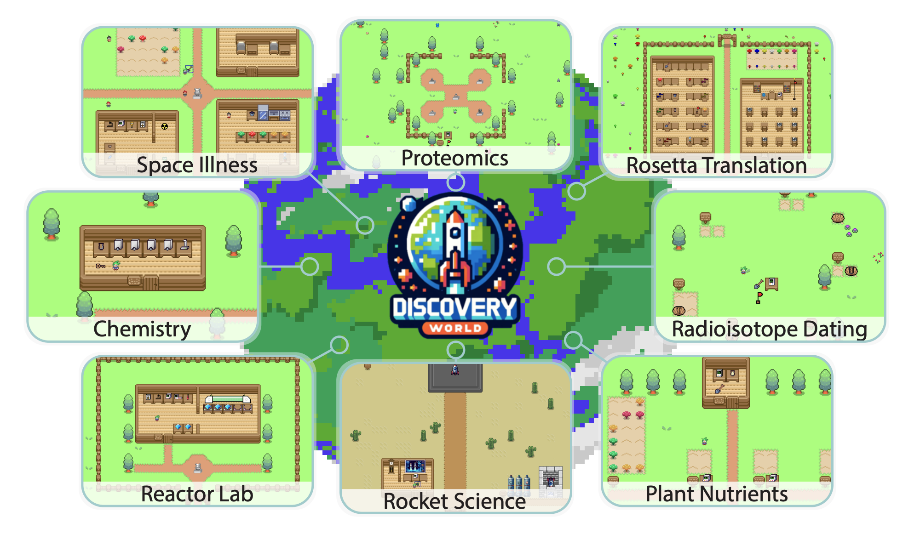

Large language models for atmospheric science.  

<!--more-->
### AtmosBench
- Constructing a benchmark for all LLMs to evaluate their professional knowledge of atmospheric science.
- Including research knowledge and course examination.

### AtmosCorpus
- collect papers, wiki, books, github.

### AtmosLLM
- Train an open-source LLM or fine-tune GPT. 
- Explore how AtmosLLM promotes interdisciplinary research and education.
- Analyse texts and figures in AtmosCorpus for certain topic.
<!--「齐天」AnyAtmos-->

### AtmosAgent
- Do atmospheric research tasks, such as performing sensitivity experiment with WRF and CESM.
<!--Atmospheric Intelligence-->

### AtmosAgents Lab
- multi-Agents collaborate to achieve one complex goal. 
- Be like [DISCOVERYWORLD](https://arxiv.org/abs/2406.06769).

